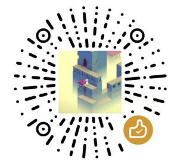

## Hi there 👋

- 🔭 I’m currently working on ...
- 🌱 I’m currently learning ...
- 👯 I’m looking to collaborate on ...
- 🤔 I’m looking for help with ...
- ❤️ I love writing Kotlin
- 💬 Ask me about anything [here](https://github.com/acc8226/acc8226/issues)
- 📫 How to reach me: ...

<!-- 统计访问次数 -->
You are my  visitor.
 

<!-- 常用语言占比统计（紧凑） -->

<!-- 仓库状态统计 -->

 

## Top Repositories

 
 

  
<strong>[点击展开] 微信赞赏支持~</strong>

